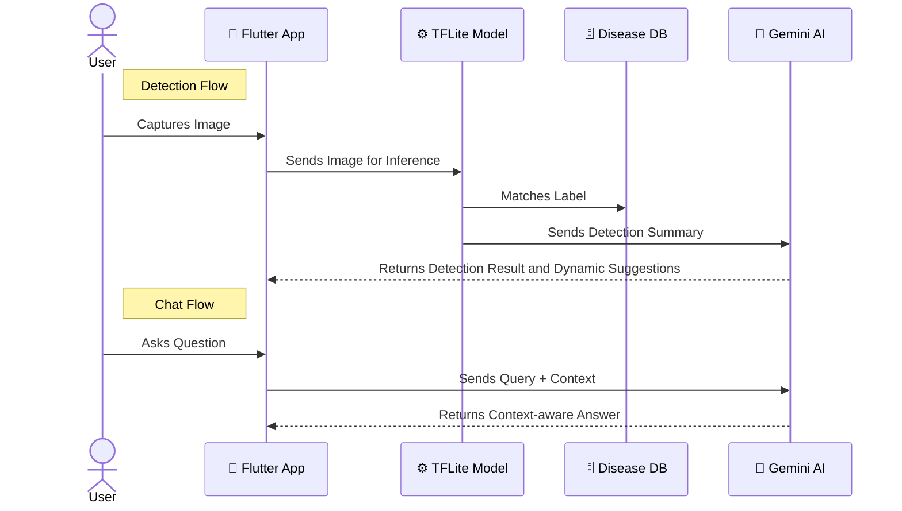

#  FarmWise AI
**FarmWise AI** is an intelligent mobile application that empowers smallholder farmers with AI-driven crop disease detection and expert farming recommendations. It leverages image recognition and on-device machine learning to identify diseases in tomato, potato, and mango crops, and provides practical mitigation guidance tailored to each case even in offline environments.


## 🌿 App Overview

In many farming communities, timely identification and management of crop diseases is a major challenge. While existing tools exist, they are often expensive, require constant internet access, or are not user-friendly. **FarmWise AI** fills this gap with a lightweight, offline-first assistant that combines:

- **Convolutional Neural Networks (CNN)** for accurate image classification.
- **On-device TensorFlow Lite (TFLite)** inference for performance and privacy.
- **Gemini-powered assistant** for personalized, AI-generated advice.
- **Rich resource support** like videos, markdown tips, and localized explanations.

---

## ⚡Features

- **Image-Based Disease Detection**  
  Capture or select a crop image to detect diseases instantly using trained CNN models.

- **Multi-Crop Support**  
  Currently supports **tomato**, **potato**, and **mango** crops each with its own tailored model and metadata.

- **AI-Powered Assistance**  
  Integrated NLP assistant that understands crop-specific questions and provides contextual replies.

- **Offline Functionality**  
  All detection is handled locally on-device with TFLite — no internet required after initial setup.

- **Expert Recommendations**  
  Displays disease-specific mitigation steps, video links, and AI-generated expert advice.

- **Local Result Storage**  
  Save and review previous detections directly from the app’s local storage.

---

### Main Components:

- **Flutter App (Frontend)**: Handles image input, UI, and navigation.
- **TFLite Inference Service**: Loads and runs the proper crop-specific model.
- **Gemini API Service**: Processes crop questions using NLP for assistant replies.
- **Hive Local Storage**: Saves detection history for offline access.
- **Markdown + Charts Renderer**: Presents confidence scores, video tips, and expert content beautifully.

---
## 🛠 Architecture

## How to Install and Run

### 1. Prerequisites

- Flutter SDK (>= 3.x)
- Dart SDK
- Android Studio or Visual Studio Code

### 2. Clone the repository

```bash
git clone https://github.com/tekle-eyesus/farmwise_ai.git
cd farmwise_ai
```
### 3. Install dependencies
```bash
flutter pub get
```
### 4. Run the app
```bash
flutter run
```
## Technologies Used
| Technology           | Purpose                            |
| -------------------- | ---------------------------------- |
| Flutter              | Cross-platform UI development      |
| TensorFlow Lite      | On-device deep learning inference  |
| Gemini Pro API       | NLP assistant integration          |
| Hive + Path Provider | Local data storage                 |
| TFLite Helper        | Image preprocessing and tensor ops |
| Image Picker         | Capture and select images          |
| Markdown             | Rich text rendering for UI tips    |
| FL Chart             | Display confidence charts          |

## TFLite Models
Each crop uses a custom-trained CNN model exported to ".tflite:"
| Crop   | Classes (Diseases)               | Input Size | Accuracy |
| ------ | -------------------------------- | ---------- | -------- |
| Tomato | 11 disease classes + healthy     | 256x256    | \~96%    |
| Potato | 3 classes                        | 256x256    | \~95%    |
| Mango  | 9 classes incl. unknown/non-leaf | 256x256    | \~94%    |

Models are trained in TensorFlow/Keras using data from Kaggle dataset sources, then optimized and quantized for mobile deployment.

## Contribution
This project is a **capstone submission** for the **FTL Ethiopia Machine Learning 2 Bootcamp** (2025 cohort).
